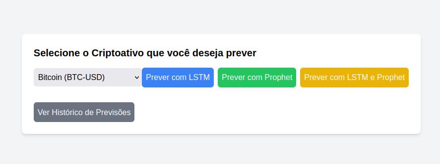

# Pergunta 4 e 5

# Existe um dashboard que apresenta os resultados do modelo:

## Dashboard de apresentação

&emsp; Sim, o sistema inclui um dashboard interativo que exibe os resultados das previsões dos modelos LSTM e Prophet. O frontend foi implementado utilizando Next.js, o que permite uma visualização clara dos resultados, com gráficos que mostram tanto as previsões futuras quanto os dados históricos de preços dos criptoativos.

&emsp; Os resultados de cada previsão são apresentados visualmente com gráficos gerados via Matplotlib, que são atualizados dinamicamente de acordo com as requisições feitas pelos usuários.

&emsp; Exemplo de código gerando os gráficos para o LSTM:

**(No código abaixo, está documentado o que cada parte faz para plotar os gráficos e as informações que devem aparecer. E essa explicação se repete para o modelo Prophet e LSTMandProphet. Vale lembrar que, o plot do gráfico está na cotação do DÓLAR, más, as informações abaixo do gráfico estam em REAIS para melhor conversão)**

Plota o fechamento REAL dos últimos 5 dias e a predição dos próximos 7 dias da moeda
```bash
    plt.plot(days_real, real_last_5_days, label='Últimos 5 dias', marker='o') #Plota o fechamento REAL dos últimos 5 dias
    plt.plot(days_future, future_predictions, label='Próximos 7 dias (LSTM)', marker='o') #Plota a predição dos próximos 7 dias
```

Coloca as cores dentro dos gráficos para pintar com um triangulo verde o MELHOR DIA DE COMPRA DA MOEDA e um triangulo vermelho o MELHOR DIA DE VENDA DA MOEDA.
```bash
    # Destacar o melhor dia para comprar e vender
    plt.scatter(best_day_buy, future_predictions[best_day_buy - 1], color='green', label='Melhor Dia para Comprar (LSTM)', marker='^', s=100) # Coloca as cores dentro dos gráficos para pintar com um triangulo verde o MELHOR DIA DE COMPRA DA MOEDA
    plt.scatter(best_day_sell, future_predictions[best_day_sell - 1], color='red', label='Melhor Dia para Vender (LSTM)', marker='v', s=100) # Coloca as cores dentro dos gráficos para pintar com um triangulo vermelho o MELHOR DIA DE VENDA DA MOEDA.
```

Coloca as devidas legendas no gráfico e salva a imagem em arquivo.png no caminho acima (para Prophet e para LSTMandProphet o nome do arquivo .png é diferente)
```bash
    # Configuração do gráfico (título do gráfico)
    plt.title(f'Previsão de Preços para {crypto} em dólares (USD)')
    plt.legend() 

    # Ajustar o caminho para salvar a imagem na pasta 'public' do Next.js
    current_dir = os.path.dirname(__file__)
    image_path_lstm = os.path.join(current_dir, '../nextjs-app/public/lstm_prediction_plot.png') # Gerando e salvando a imagem em arquivo.png no caminho acima
    plt.savefig(image_path_lstm)
    plt.close()
```

Formata as previsões para fazer um "for" e mostra os dados em REAIS por que estamos fazendo a conversão quando multiplicamos por 5.53 o "price". 
```bash
    # Formatar as previsões para exibir no frontend
    predictions = [f"Dia {i+1}: Previsão de fechamento: R$ {float(price*5.53):.2f}" for i, price in enumerate(future_predictions)] # Previsão 

    return {"imageUrl": "/lstm_prediction_plot.png", "predictions": predictions}
```

## Dashboard existente para visualização dos resultados

&emsp; O dashboard de visualização serve para que nós consigamos escolher qual moeda nós queremos prever e clicar nos botões correspondentes escolhendo os modelos que a pessoa quer visualizar.



&emsp; Podemos visualizar que temos 4 botões e um campo seletor (BTC, ETH e BNB)

&emsp; Resultado:
|Botões|Funcionalidade
|---|---|
|Prever com LSTM|Utiliza o modelo LSTM para poder prever o fechamento dos próximos 7 dias para qualquer moeda escolhida|
|Prever com Prophet|Utiliza o modelo Prophet para poder prever o fechamento dos próximos 7 dias para qualquer moeda escolhida|
|Prever com LSTM e Prophet|Utiliza o modelo LSTM e o Prophet para poder prever o fechamento dos próximos 7 dias para qualquer moeda escolhida e fazer uma comparação entre os dois modelos para ter uma noção das diferenças entre os dois|
|Ver históticos de Previsões|Botão que leva para a página de logs para poder visualizar quais modelos ja foram previstos e quando
|Botão Seletor|Serve para poder escolher a moeda que queremos prever (BTC, ETH e BNB)|
