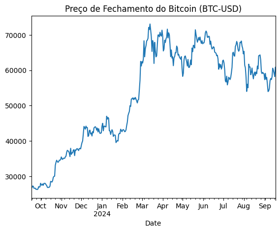
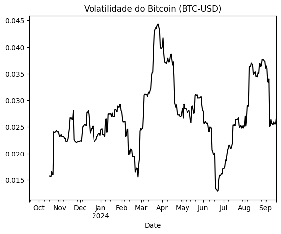
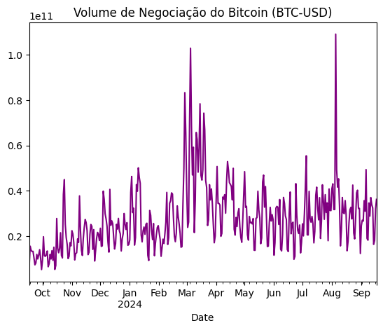
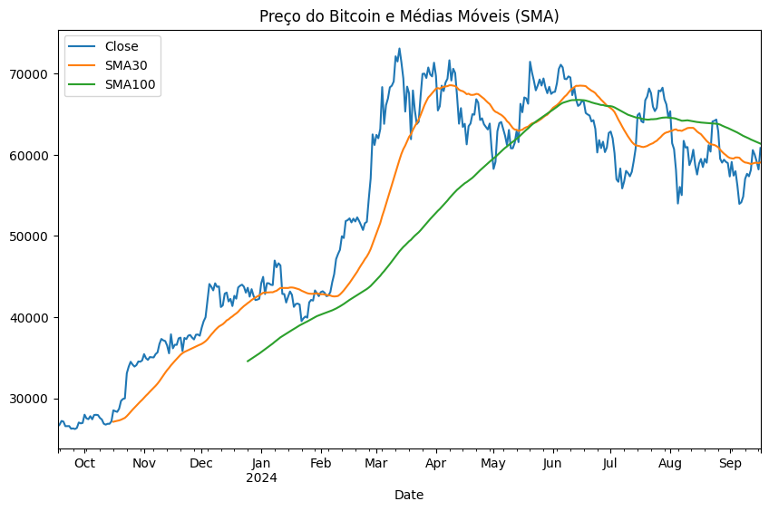
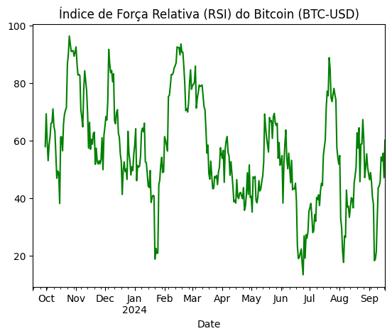
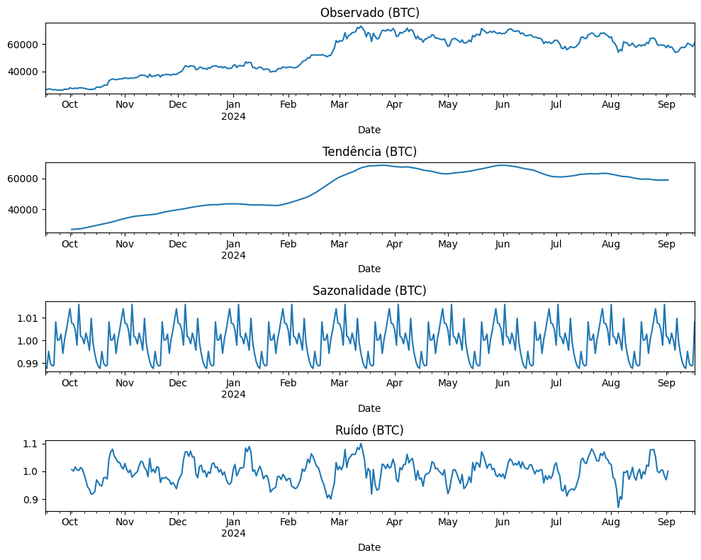

# Pergunta 1

# Existiu uma etapa de exploração de dados para escolher os modelos e dados considerados;

&emsp; Nessa primeira isntância, fiz a parte de exploração dos dados e a escolha do modelo para seguir com o projeto.
&emsp; Vale destacar que e mostrar que os dados de exploração EDA (Exploratory Data Analysis) foi feita e está disposta no caminho de pastas abaixo

```bash
Ponderada_mod_7 > src > notebooks > exploracao_dos_dados.ypnb
```

# Como foi trabalhado a exploração desses dados ?

## Entendimento dos dados:

&emsp; Estou usando a biblioteca de dados **"Yfinance"** para pegar e fazer um modelo para a cotação das criptomoedas mesmo. Analisando os dados, usamos essa parte do código passando um nome da criptomoeda ou nome do "papel" e ele trás essas infos por default:

```bash 
# Buscando dados do Bitcoin usando yfinance
btc = yf.Ticker('BTC-USD')
btc_data = btc.history(period='1y')

# Exibindo as primeiras linhas dos dados
btc_data.head()
```
&emsp; Resultado:
|Date|Open|High|Low|Close|Volume|Dividends|Stock Splits|
|---|---|---|---|---|---|---|---|
|2023-09-18 00:00:00+00:00|26532\.994140625|27414\.734375|26415\.515625|26754\.28125|15615339655|0\.0|0\.0|
|2023-09-17 00:00:00+00:00|26567\.927734375|26617\.998046875|26445\.07421875|26534\.1875|6774210670|0\.0|0\.0|
|2023-09-19 00:00:00+00:00|26760\.8515625|27488\.763671875|26681\.60546875|27211\.1171875|13807690550|0\.0|0\.0|
|2023-09-21 00:00:00+00:00|27129\.83984375|27152\.939453125|26389\.30078125|26567\.6328125|13371443708|0\.0|0\.0|
|2023-09-20 00:00:00+00:00|27210\.228515625|27379\.505859375|26864\.08203125|27132\.0078125|13281116604|0\.0|0\.0|

&emsp; Depois, pegamos outra parte do trecho do código para poder mais informações dos dados como:

```bash
print('Tipo dos dados:', type(btc_data))
print('Dimensões dos dados:', btc_data.shape)
print('Colunas dos dados:', btc_data.columns)
print('Informações dos dados:', btc_data.info())
```

&emsp; Logo depois, obtive o tipo de índice e os valores do índice:

```bash
print('Tipo do índice:', type(btc_data.index))
print('Valores do índice:', btc_data.index)
```
&emsp; Uma visualização importante para que o nosso futuro modelo é o de preço de fechamento das ações conforme o passar dos dias:

```bash
# Plotando o preço de fechamento do Bitcoin
btc_data['Close'].plot(title='Preço de Fechamento do Bitcoin (BTC-USD)')
plt.show()
```
&emsp; Resultado:



&emsp; Análise de volatilidade:
    &emsp;A volatilidade é um dos indicadores mais importantes no mercado de criptomoedas. Podemos calcular a volatilidade como o desvio padrão da variação percentual diária do preço de fechamento.

```bash
# Calculando a volatilidade (desvio padrão da variação percentual diária)
btc_data['Returns'] = btc_data['Close'].pct_change()
btc_data['Volatility'] = btc_data['Returns'].rolling(window=30).std()

# Plotando a volatilidade
btc_data['Volatility'].plot(title='Volatilidade do Bitcoin (BTC-USD)', color='black')
plt.show()
```
&emsp; Resultado:



&emsp; Volume de Negociação: 
    &emsp; O volume de negociação é outro indicador relevante no mercado de criptomoedas, indicando a atividade e o interesse dos investidores.

```bash
# Plotando o volume de negociação do Bitcoin
btc_data['Volume'].plot(title='Volume de Negociação do Bitcoin (BTC-USD)', color='purple')
plt.show()
```

&emsp; Resultado:



&emsp; Médias Móveis Simples (SMA): 
    &emsp; Médias móveis ajudam a identificar tendências de curto e longo prazo no preço de um ativo, sendo comuns na tomada de decisão de compra e venda.

```bash
# Calculando as médias móveis simples (SMA) de 30 dias e 100 dias
btc_data['SMA30'] = btc_data['Close'].rolling(window=30).mean()
btc_data['SMA100'] = btc_data['Close'].rolling(window=100).mean()

# Plotando o preço de fechamento e as médias móveis
btc_data[['Close', 'SMA30', 'SMA100']].plot(title='Preço do Bitcoin e Médias Móveis (SMA)', figsize=(10, 6))
plt.show()
```
&emsp; Resultado:



&emsp; Índice de Força Relativa (RSI): 
    &emsp; O RSI é um indicador técnico que mede a velocidade e a mudança dos movimentos de preço, sendo útil para identificar condições de sobrecompra ou sobrevenda.

```bash
def calculate_rsi(data, window=14):
    delta = data['Close'].diff(1)
    gain = delta.where(delta > 0, 0)
    loss = -delta.where(delta < 0, 0)

    avg_gain = gain.rolling(window=window).mean()
    avg_loss = loss.rolling(window=window).mean()

    rs = avg_gain / avg_loss
    rsi = 100 - (100 / (1 + rs))
    
    return rsi

# Calculando o RSI com janela de 14 dias
btc_data['RSI'] = calculate_rsi(btc_data)

# Plotando o RSI
btc_data['RSI'].plot(title='Índice de Força Relativa (RSI) do Bitcoin (BTC-USD)', color='green')
plt.show()
```
&emsp; Resultado:



&emsp; Decomposição da Série Temporal: 
    &emsp; A decomposição da série temporal ajuda a entender a tendência, sazonalidade e o ruído nos dados.

```bash
# Decompondo a série temporal para o Bitcoin
decomposition = seasonal_decompose(btc_data['Close'], model='multiplicative', period=30)

# Plotando a decomposição
fig, axes = plt.subplots(4, 1, figsize=(10, 8))
decomposition.observed.plot(ax=axes[0], title='Observado (BTC)')
decomposition.trend.plot(ax=axes[1], title='Tendência (BTC)')
decomposition.seasonal.plot(ax=axes[2], title='Sazonalidade (BTC)')
decomposition.resid.plot(ax=axes[3], title='Ruído (BTC)')
plt.tight_layout()
plt.show()
```
&emsp; Resultado:



# Conclusão:

&emsp; Essas análises fornecem insights importantes sobre o comportamento do preço do Bitcoin e podem ser usadas para decisões de compra e venda.